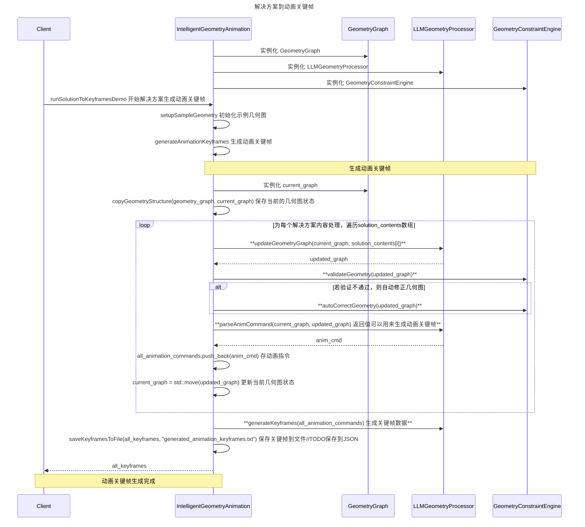

```mermaid
---
title: 解决方案到动画关键帧
---
sequenceDiagram

participant Client
participant IntelligentGeometryAnimation
participant GeometryGraph
participant LLMGeometryProcessor
participant GeometryConstraintEngine

IntelligentGeometryAnimation->>GeometryGraph: 实例化 GeometryGraph
IntelligentGeometryAnimation->>LLMGeometryProcessor: 实例化 LLMGeometryProcessor
IntelligentGeometryAnimation->>GeometryConstraintEngine: 实例化 GeometryConstraintEngine
Client->>IntelligentGeometryAnimation: runSolutionToKeyframesDemo 开始解决方案生成动画关键帧
IntelligentGeometryAnimation->>IntelligentGeometryAnimation: setupSampleGeometry 初始化示例几何图
IntelligentGeometryAnimation->>IntelligentGeometryAnimation: generateAnimationKeyframes 生成动画关键帧
Note over IntelligentGeometryAnimation,GeometryConstraintEngine: 生成动画关键帧
IntelligentGeometryAnimation->>GeometryGraph: 实例化 current_graph
IntelligentGeometryAnimation->>IntelligentGeometryAnimation: copyGeometryStructure(geometry_graph, current_graph) 保存当前的几何图状态
loop 为每个解决方案内容处理，遍历solution_contents数组
	IntelligentGeometryAnimation->>LLMGeometryProcessor: **updateGeometryGraph(current_graph, solution_contents[i])**
	LLMGeometryProcessor-->>IntelligentGeometryAnimation: updated_graph
	IntelligentGeometryAnimation->>GeometryConstraintEngine: **validateGeometry(updated_graph)**
	alt 若验证不通过，则自动修正几何图
		IntelligentGeometryAnimation->>GeometryConstraintEngine: **autoCorrectGeometry(updated_graph)**
	end
	IntelligentGeometryAnimation->>LLMGeometryProcessor: **parseAnimCommand(current_graph, updated_graph) 返回值可以用来生成动画关键帧**
	LLMGeometryProcessor-->>IntelligentGeometryAnimation: anim_cmd
	IntelligentGeometryAnimation->>IntelligentGeometryAnimation: all_animation_commands.push_back(anim_cmd) 存动画指令
	IntelligentGeometryAnimation->>IntelligentGeometryAnimation: current_graph = std::move(updated_graph) 更新当前几何图状态
end
IntelligentGeometryAnimation->>LLMGeometryProcessor: **generateKeyframes(all_animation_commands) 生成关键帧数据**
IntelligentGeometryAnimation->>IntelligentGeometryAnimation: saveKeyframesToFile(all_keyframes, "generated_animation_keyframes.txt") 保存关键帧到文件//TODO保存到JSON
IntelligentGeometryAnimation-->>Client: all_keyframes
Note over Client,IntelligentGeometryAnimation: 动画关键帧生成完成
```